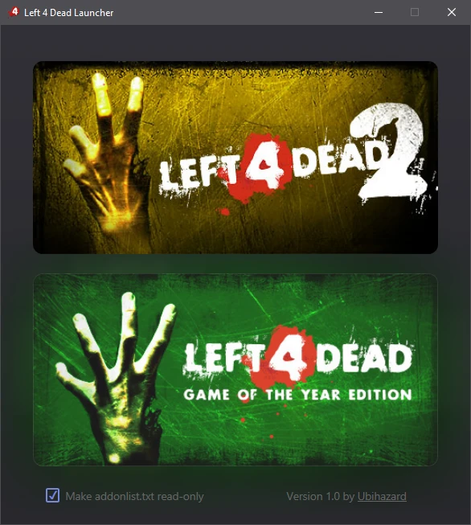

<p align="center"></p>
<h1 align="center">Left 4 Dead Launcher</h1>

<!--


Left 4 Dead Launcher
====================
-->

Launcher for Valve’s [Left 4 Dead 2](https://store.steampowered.com/app/550) allows to start the game client with different set of addons and enforce the addon order by making `addonlist.txt` read-only using a nice convenient GUI.



Primarily, this is used to make the game better fit the feeling and atmosphere of the [original Left 4 Dead](https://store.steampowered.com/app/500) when playing the ported Left 4 Dead 1 campaigns and other content featuring the original survivors. This is achieved by means of automatically enabling (or disabling) a pre-configured set of addons, which either “convert” the game to Left 4 Dead 1 art style, or do the reverse and switch back to more light-hearted Left 4 Dead 2 art style, – all with a single button press in the launcher.

Left 4 Dead launcher is built as a [Microsoft HTML Application](https://learn.microsoft.com/en-us/previous-versions/ms536496(v=vs.85)) (HTA), which means it is open by nature, very lightweight, and doesn’t depend on any huge runtime.

How to Use
----------

  * Download [core VPKs](https://drive.google.com/drive/folders/19-pyWdOulIBfPqkBIr8szpqkNown9Ni3?usp=sharing) that need to be loaded early in the game loading process. Extract them to `Steam\steamapps\common\Left 4 Dead 2`. You will end up with two more folders in game directory: `left4dead1` and `fontscheme`. The `left4dead1` folder contains VPKs that get activated when launching the game in Left 4 Dead 1 mode, they include the original font and loading screen graphics. The `fontscheme` folder serves similar purpose when launching the game in Left 4 Dead 2 mode instead.

  * Download the original and enhanced Left 4 Dead 1 menu screen [cinematics](https://drive.google.com/file/d/1cRsHV8eaaaKerdUl4PTypTeD41C0TJqy/view?usp=sharing), rename them by putting `.l4d1` after their file name and before the `.bik` file extension, like so: `l4d2_background01.l4d1.bik` (repeat for 4 remaining video backgrounds), and move them to `Steam\steamapps\common\Left 4 Dead 2\left4dead2\media`. Make sure not to replace any original Left 4 Dead 2 cinematic files.

  * Optionally, download the [example Left 4 Dead 1 VPK](https://drive.google.com/file/d/136CFHVnI_qQqoa62vCwAolH9OmbbLcd6/view?usp=sharing), put it inside `Steam\steamapps\common\Left 4 Dead 2\left4dead2\addons`, and add it to the list of VPKs to [activate](https://github.com/ubihazard/l4d-launcher#configuring-the-launcher) in `launcher.cfg`: `l4d1.vpk 1`.

  * Download the [latest L4D launcher release](https://github.com/ubihazard/l4d-launcher/releases) and extract the launcher files to `Steam\steamapps\common\Left 4 Dead 2`, where `left4dead2.exe` is located. Double-click the `launcher.hta` to reveal its GUI.

L4D launcher works with Valve’s [Steam](https://store.steampowered.com/about/), which has to be installed on your system. The game will be launched through Steam and will inherit all launch options you’ve got configured in Steam properties for Left 4 Dead 2.

Configuring the Launcher
------------------------

`launcher.cfg` contains the list of VPKs to activate or de-activate when launching the game. To activate a particular VPK (when launching as Left 4 Dead 1), add it with `1` after its name (just like `addonlist.txt`); to activate it when launching Left 4 Dead 2, add it with `0` instead. An example of well-formatted `launcher.cfg`:

```ini
make_addonlist_read_only=no
l4d1_addon_vpks=
l4d1.vpk 1
scar-l.vpk 0
m4a4.vpk 1
```

In short, `1` enables the addon in Left 4 Dead 1 mode and, conversely, disables it in Left 4 Dead 2 mode; `0` works vice versa (disables in L4D1 and enables in L4D2).

In order for `launcher.cfg` to appear, L4D launcher has to be run at least once.

Additional VPKs
---------------

The `addons` subfolder inside the [shared folder](https://drive.google.com/drive/folders/19-pyWdOulIBfPqkBIr8szpqkNown9Ni3?usp=sharing) contains several addon packs assembled from publicly available sources intended to fix many bugs present in the game and greatly enhance the vanilla experience. Many of included addons were modified and enhanced by me: mostly `.vtf` textures using my [VTF tools](https://github.com/ubihazard/vtf-tools). Each VPK contains a detailed list of mods used in the pack and their respective authors, along with the brief list of modifications and/or bug fixes performed on them (where applicable). The accompanying `sources` subfolder has all original Blender and Photoshop files for every piece of content altered by me: models, animations, textures, scripts, etc.

All of this is optional and none of this is required for the Left 4 Dead launcher to work: you are welcome to assemble your own mod pack(s) and make your own list of mods to activate in `launcher.cfg`.

⭐ Support
---------

If you like [Left 4 Dead launcher](https://github.com/ubihazard/l4d-launcher), you can [buy me a ☕](https://www.buymeacoffee.com/ubihazard "Donate")!
