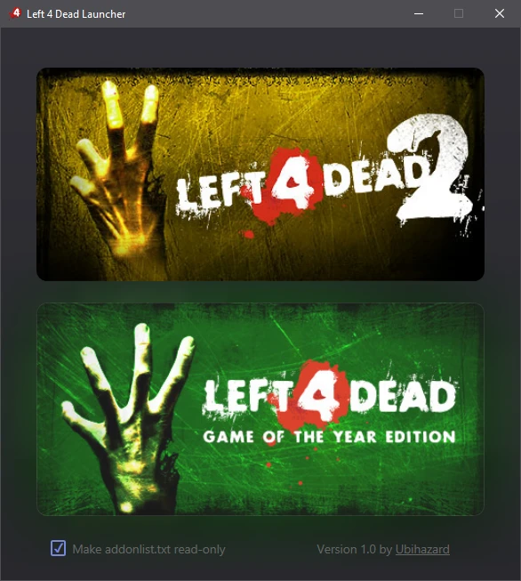

<p align="center"></p>
<h1 align="center">Left 4 Dead Launcher</h1>

<!--


Left 4 Dead Launcher
====================
-->

Launcher for Valve’s [Left 4 Dead 2](https://store.steampowered.com/app/550) allows to start the game in two different modes: in its usual state or in [original Left 4 Dead](https://store.steampowered.com/app/500) mode. Both modes can have their own different sets of addons and the addon order can be additionally enforced by making `addonlist.txt` read-only, which is useful when you have to combine conflicting items that depend on each other in a specific order, but game keeps randomly re-arranging them.



In 2010 Valve released the original “No Mercy” campaign for Left 4 Dead 2 as part of “The Sacrifice” update. Two years later the rest of campaigns from the first game followed with the release of “Cold Stream” DLC. While the ability to play original campaigns with new special infected, weapons, mechanics, and technical improvements was a welcome addition, the ports were quite straightforward in their nature and lacked necessary adjustments to properly integrate them into the sequel. Oversights included zombies from southern regions of United States wearing summer clothes in what appeared to be late autumn midwest setting of the predecessor, new special infected zombies not really fitting classic atmosphere and art style, as well as numerous bugs and exploits. Although most recent update, “The Last Stand”, finally addressed most of the glaring issues, it still didn't improve visuals enough to bring them on par with the core Left 4 Dead 2 campaigns quality-wise.

Now, with the help of Left 4 Dead launcher and the power of amazing [Left 4 Dead modding community](https://steamcommunity.com/app/550/workshop/), the remaining bits can be fixed. Technically, what the launcher does is it toggles a pre-configured set of addons depending on which game you start, – all with a single button press. Stuff that can be changed: models, textures, HUD, menus, etc., – anything that can be modified using game’s addon system.

So what it actually helps to achieve:

  * Restore dark and moody atmosphere of the original game as opposed to more light-hearted feeling of the sequel, which is useful when playing the ported Left 4 Dead 1 campaigns and other content featuring the original survivors.
  * Alternative special infected models redesigned by community to better fit original campaigns.
  * Common infected adjustments for more zombie variations, just like in the [second game](https://en.wikipedia.org/wiki/Left_4_Dead_2#Development).
  * Some weapon changes to make classic content stand out more: colt replaces magnum, concrete cutter instead of chainsaw, etc. Other miscellaneous items like props and textures from original game.
  * Original loading screen, menu cinematics, font, and graphics featuring L4D1 cast instead of L4D2 survivors and infected.
  * Classic Left 4 Dead HUD.

Left 4 Dead launcher is built as a [Microsoft HTML Application](https://learn.microsoft.com/en-us/previous-versions/ms536496(v=vs.85)), which means it is very lightweight, does not depend on a huge runtime, and, as a result, does not have any noticeable footprint.

How to Use
----------

  * Download the [core VPKs](https://drive.google.com/drive/folders/19-pyWdOulIBfPqkBIr8szpqkNown9Ni3?usp=drive_link) and extract them to `Steam\steamapps\common\Left 4 Dead 2`. You will end up with two more folders in game directory: `left4dead1` and `fontscheme`. The `left4dead1` folder contains VPKs that activate when launching the game in Left 4 Dead 1 mode: they include the original font and loading screen graphics. The `fontscheme` has the Left 4 Dead 2 font instead. (You can also find the core VPKs on the [release page](https://github.com/ubihazard/l4d-launcher/releases/tag/1.1).)

  * Download Left 4 Dead 1 menu screen [cinematics](https://github.com/ubihazard/l4d-launcher/releases/download/1.1/Videos.zip) and move them to `Steam\steamapps\common\Left 4 Dead 2\left4dead2\media`. There are also alternative HD backgrounds [available on Workshop](https://steamcommunity.com/sharedfiles/filedetails/?id=2490673505). Make sure to rename the files by putting `.l4d1` after their file name and before the `.bik` file extension, like so: `l4d2_background01.l4d1.bik`. Do not replace any of the original Left 4 Dead 2 cinematic files.

  * You will need some VPK with original and improved L4D1 content. A pre-made VPK (`l4d1.vpk`) is [available](https://drive.google.com/drive/folders/19-pyWdOulIBfPqkBIr8szpqkNown9Ni3?usp=drive_link) from the same shared Google Drive folder. This is the VPK that contains patches listed above. Put it inside `Steam\steamapps\common\Left 4 Dead 2\left4dead2\addons` and add it to the list of VPKs for [activation in L4D1](https://github.com/ubihazard/l4d-launcher#configuring-the-launcher) in `launcher.cfg`: `l4d1.vpk 1`. Of course you can make your own VPKs if you know how to mod the game.

  * Download the [latest L4D launcher release](https://github.com/ubihazard/l4d-launcher/releases) and extract the launcher files to `Steam\steamapps\common\Left 4 Dead 2` where `left4dead2.exe` is located. Double-click the `launcher.hta` to reveal its GUI.

L4D launcher works with Valve’s [Steam](https://store.steampowered.com/about/), which has to be installed on your system. The game will be launched through Steam and will inherit all launch options you’ve got configured in Steam properties for Left 4 Dead 2.

Configuring the Launcher
------------------------

`launcher.cfg` has got the list of VPKs to activate or de-activate when launching the game in different mode. To activate a certain VPK when launching as Left 4 Dead 1, add it with `1` after its name (similar to `addonlist.txt`), or with `0` instead if launched as Left 4 Dead 2. A VPK that is enabled in L4D1 will be disabled in L4D2, and vice versa. (`launcher.cfg` is located at `Steam\steamapps\common\Left 4 Dead 2\left4dead2\cfg`. In order for `launcher.cfg` to appear, L4D launcher needs to be run at least once.)

An example of a well-formatted `launcher.cfg`:

```ini
style_crosshair=no
make_addonlist_read_only=no
l4d1_addon_vpks=
l4d1.vpk 1
scar-l.vpk 0
m4a4.vpk 1
```

Make sure VPKs that you configure in launcher are actually present in game’s `addonlist.txt` file located at `Steam\steamapps\common\Left 4 Dead 2\left4dead2`.

Use `style_crosshair` to toggle styling of crosshair (it is blue in L4D1 and green in L4D2). If enabled, add this to your `autoexec.cfg`:

```ini
exec crosshair_launcher
```

Ensure `crosshair_l4d2.cfg`, and `crosshair_l4d1.cfg` exist in `Steam\steamapps\common\Left 4 Dead 2\left4dead2\cfg` configuration folder.

Set `make_addonlist_read_only` to `yes` if you need to enforce addon loading order. But don't forget to disable this option and manually clear read-only flag on `addonlist.txt` when adding new or removing old game addons. This setting is also easily accessible from launcher’s UI.

Additional VPKs
---------------

The `addons` subfolder inside the [shared folder](https://drive.google.com/drive/folders/19-pyWdOulIBfPqkBIr8szpqkNown9Ni3?usp=drive_link) contains several addon packs assembled from publicly available sources (mostly Workshop) with various enhancements and bug fixes with the goal of staying as close as possible to vanilla experience. Many of the included addons were modified by me. Some `.vtf` textures were touched up using my [lossless DXT VTF tools](https://github.com/ubihazard/vtf-tools).

The `modding` subfolder has most of the source files for every piece of content which I had to create, patch, or modify in some way: models, animations, textures, etc.
